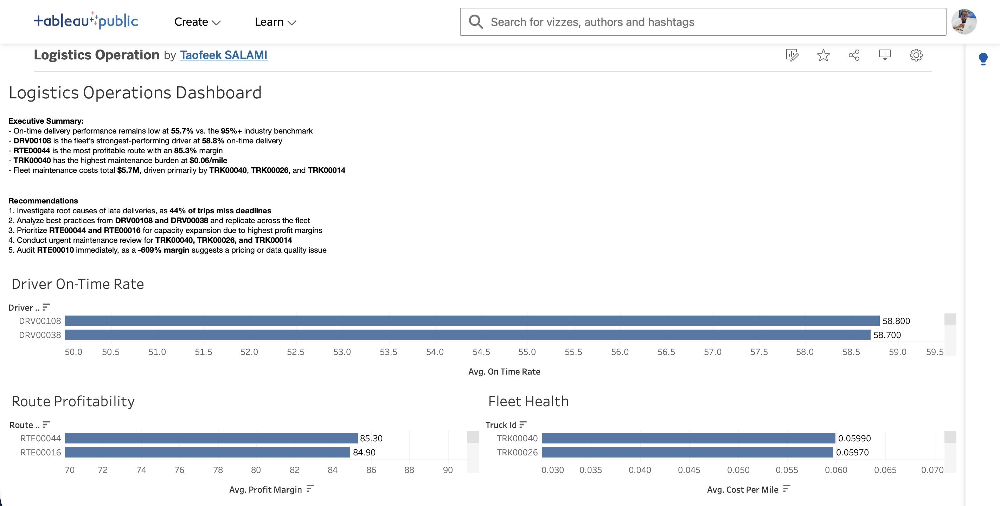

# Logistics Operations Performance Analysis

An end-to-end data analysis capstone project on a logistics operations database, investigating fleet efficiency, route profitability, and maintenance cost drivers across a 14-table relational dataset.



---

## Problem Statement

Logistics operations depend on the interaction of three variables — delivery reliability, route profitability, and fleet maintenance cost — yet these are often analysed separately.

This project consolidates a 14-table logistics database (85,000+ trip records) into a single analytical workflow to evaluate driver performance, route-level profitability, and fleet health, surfacing where operational or pricing issues may be eroding margin.

---

## Executive Summary

The fleet's on-time delivery rate sits at **55.7%**, well below the 95%+ industry benchmark, indicating a systemic reliability gap rather than isolated underperformance.

At the route level, profitability varies sharply: the top-performing route (**RTE00044**) delivers an **85.3% profit margin**, while the weakest (**RTE00010**) shows a **-609% margin** — a result significant enough to point to either a pricing error or a data-quality issue requiring investigation.

Maintenance spend across the fleet totals **$5.7M**, with cost concentrated in a small number of high-cost vehicles, led by **TRK00040** at **$0.06/mile**.

---

## Business Questions

This project set out to answer:

- How reliable is fleet delivery performance relative to industry benchmarks?
- Which drivers and routes perform best — and worst — and why?
- Where is maintenance cost concentrated across the fleet?
- Are there routes or vehicles whose numbers suggest a pricing or data-quality problem rather than genuine performance?

---

## Key Findings

**Fleet Performance**
- Fleet on-time rate: **55.7%** vs. 95%+ industry benchmark
- Top driver **DRV00108** achieves a **58.8%** on-time delivery rate

**Route Profitability**
- Most profitable route **RTE00044**: **85.3%** profit margin
- **RTE00010** shows a **-609%** margin — flagged for pricing or data-quality review

**Fleet Maintenance**
- Total fleet maintenance spend: **$5.7M**
- **TRK00040** has the highest maintenance cost at **$0.06/mile**

---

## Recommendations

- **Investigate the fleet-wide on-time gap.** A 40-point shortfall against benchmark suggests a structural issue (scheduling, routing, or capacity) rather than isolated driver performance.
- **Audit RTE00010 before drawing business conclusions.** A -609% margin is an outlier large enough to warrant a data-quality check before it's treated as a genuine pricing failure.
- **Review high-cost vehicles like TRK00040** for maintenance patterns that could inform fleet replacement or preventive-maintenance scheduling.
- **Study top performers (DRV00108, RTE00044)** to identify replicable practices behind above-benchmark reliability and margin.

---

## Tools & Technologies

| Tool | Purpose |
|---|---|
| Python (pandas, matplotlib, seaborn) | Data cleaning and analysis |
| Jupyter Notebook | Development environment |
| Tableau Public | Interactive dashboard |
| Git & GitHub | Version control |

---

## Dataset Overview

| Attribute | Value |
|---|---|
| Tables | 14 |
| Records | 85,000+ trips |
| Project Type | End-to-End Logistics Operations Analytics |

---

## Project Structure

```
logistics-analysis/
├── data/                              ← Raw CSV files (14 tables)
├── notebooks/
│   ├── 01_data_exploration.ipynb      ← Load all 14 tables, check nulls, verify FK relationships
│   ├── 02_cleaning.ipynb              ← Fix nulls, convert data types, export clean CSVs
│   └── 03_analysis.ipynb              ← Driver performance, route profitability, fleet health
├── exports/                           ← Clean CSVs and chart PNGs
├── dashboard/
│   └── dashboard_preview.png
└── README.md
```

---

## Dashboard

🔗 [View Live Dashboard](https://public.tableau.com/app/profile/taofeek.salami/viz/LogisticsOperation/LogisticsOperationsDashboard?publish=yes)

---

## Author

**Salami Taofeek**
Data Analyst | SQL | Python | Tableau

GitHub: [HarjiiBoss](https://github.com/HarjiiBoss)
